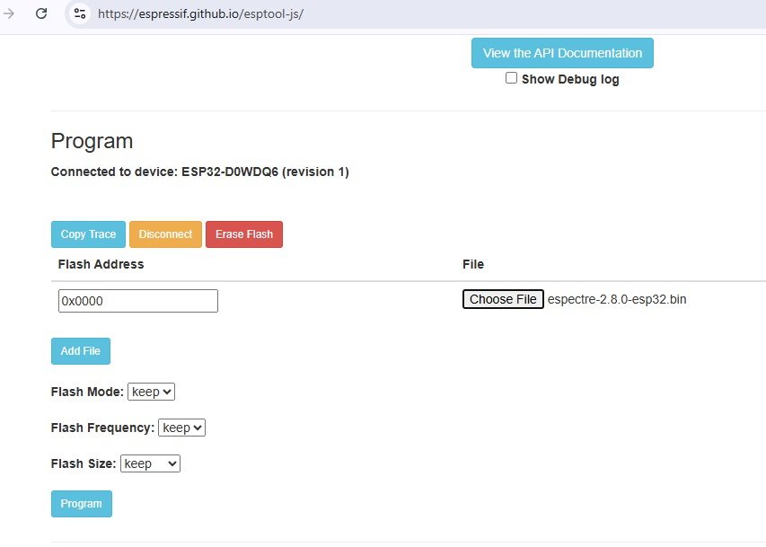
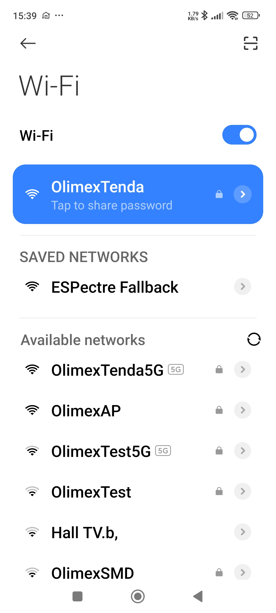
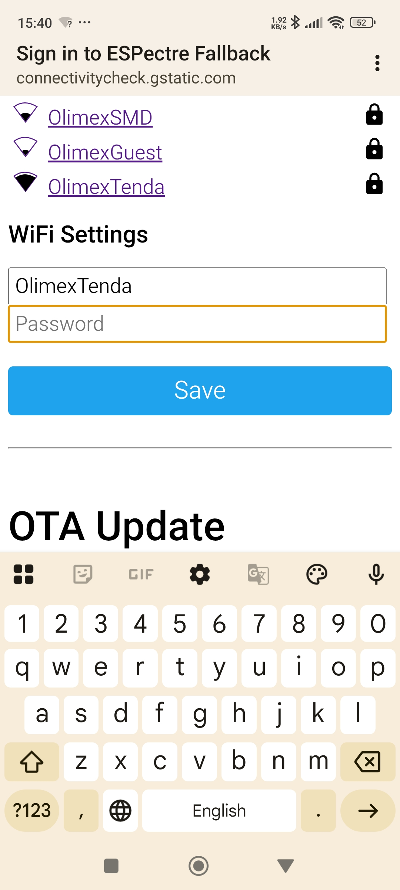
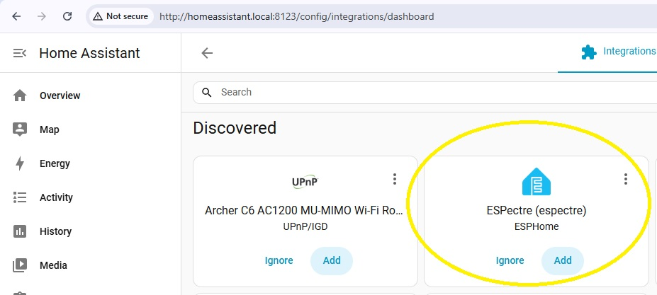
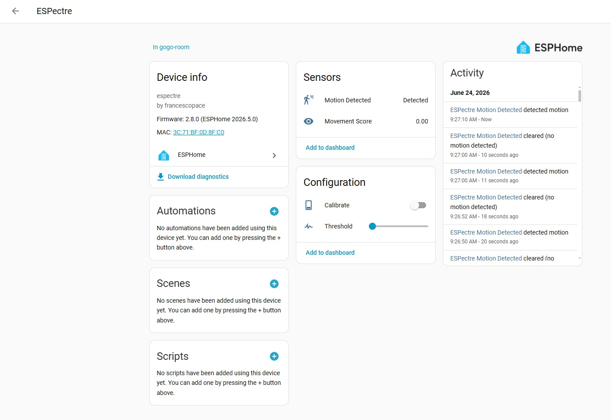

# Using ESPectre with Olimex ESP32-POE / ESP32-POE-ISO and Home Assistant

This guide shows how to flash an Olimex [ESP32-POE](https://www.olimex.com/Products/IoT/ESP32/ESP32-POE/open-source-hardware) or [ESP32-POE-ISO](https://www.olimex.com/Products/IoT/ESP32/ESP32-POE-ISO/open-source-hardware) board with [ESPectre](https://espectre.dev/) and add it to [Home Assistant](https://www.home-assistant.io/) through ESPHome.

ESPectre is a motion detection system based on Wi-Fi Channel State Information (CSI). It detects movement by analyzing changes in the Wi-Fi signal between an ESP32 board and a Wi-Fi router or access point.

The steps below were tested with:

- Olimex ESP32-POE / ESP32-POE-ISO
- ESPectre `2.8.0`
- Home Assistant running on a Raspberry Pi
- ESPHome integration in Home Assistant

## 1. Install and prepare Home Assistant

First, you need a working Home Assistant server. In this setup, Home Assistant is running on a Raspberry Pi, but you can also use another supported board, mini PC, virtual machine, or computer.

Follow the official Home Assistant installation guide and choose the installation method that fits your hardware:

<https://www.home-assistant.io/installation/>

Make sure you can open your Home Assistant web interface before continuing. For example:

```text
http://homeassistant.local:8123/
```

The Home Assistant server and the ESP32 board must be on the same local network.

## 2. Download the ESPectre firmware

Download the pre-built ESPectre binary for the ESP32 chip from the latest ESPectre release:

<https://github.com/francescopace/espectre/releases/latest>

At the time of writing, this guide used:

<https://github.com/francescopace/espectre/releases/download/2.8.0/espectre-2.8.0-esp32.bin>

If you use a different ESP32 variant, download the correct binary for that chip.

## 3. Flash the Olimex ESP32 board

Connect the Olimex ESP32 board to your computer with a USB data cable.

You can flash the binary using different tools. This guide uses Espressif's online flasher:

<https://espressif.github.io/esptool-js/>

Open the flasher in a supported browser, such as Chrome or Edge.

1. Select a baud rate. A safe option is `115200`.
2. Click **Connect**.
3. Select the serial port for the Olimex ESP32 board.
4. Click **Connect** again.

Set the flash address to:

```text
0x0000
```

This is important. The ESPectre `.bin` file used here is a factory image and must be flashed at address `0x0000`. If it is flashed at another address, for example `0x1000`, the board will not boot correctly.

Click **Choose File** and select the ESPectre binary, for example:

```text
espectre-2.8.0-esp32.bin
```

Leave the other flash settings at their default values unless you have a specific reason to change them.



Click **Program** and wait until flashing completes successfully.

## 4. Connect the board to Wi-Fi

After flashing, the board has the ESPectre firmware installed, but it still needs Wi-Fi credentials.

There are several ways to configure Wi-Fi. This guide uses the fallback Wi-Fi access point from a phone.

1. Reboot the Olimex ESP32 board by pressing the reset button.
2. On your phone, open the Wi-Fi settings.
3. Connect to the network named **ESPectre Fallback**.



After connecting, your phone should open the ESPectre captive portal automatically. If it does not open automatically, try opening:

```text
http://192.168.4.1/
```

Select your normal 2.4 GHz Wi-Fi network and enter its password.

The board and the Home Assistant server must be connected to the same network. In this example, the selected network is `OlimexTenda`.



Click **Save**. Wait until the page closes or the phone reconnects to your normal Wi-Fi network.

The **ESPectre Fallback** network should disappear after the board successfully joins your Wi-Fi network.

## 5. Add ESPectre to Home Assistant

Open your local Home Assistant web interface and log in with an administrator account:

```text
http://homeassistant.local:8123/
```

Go to:

```text
Settings -> Devices & services
```

Home Assistant should automatically discover the ESPectre device through ESPHome.

Look for **ESPectre** under discovered integrations and click **Add**.



Click **Submit**. You can then assign a name and area/room if you want.

If the device is not discovered automatically, add it manually:

1. Go to **Settings -> Devices & services**.
2. Click **Add integration**.
3. Search for **ESPHome**.
4. Use `espectre.local` as the host.
5. Use port `6053`.

If `espectre.local` does not work, find the board's IP address in your router DHCP/client list and use that IP address instead.

## 6. Test motion detection

After adding the device, open the ESPectre device page in Home Assistant.

You should see entities such as:

- Motion Detected
- Movement Score
- Calibrate
- Threshold

Place the board with the antenna facing upward, preferably on the opposite side of the monitored area from the Wi-Fi router or access point.

For the first test:

1. Keep the room still.
2. Calibrate the sensor with no movement in the room.
3. Walk between the Wi-Fi router and the ESP32 board.
4. Watch the motion state and movement score in Home Assistant.
5. Adjust the threshold if needed.



The best threshold depends on the room, router position, board position, and how sensitive you want the detection to be.

## Notes

- The pre-built ESPectre binary used here is for the original ESP32 chip.
- The ESP32-POE and ESP32-POE-ISO can be powered through PoE, but the pre-built ESPectre firmware uses Wi-Fi for CSI motion detection.
- Use a 2.4 GHz Wi-Fi network. ESP32 boards do not support 5 GHz Wi-Fi.
- If the fallback network appears again after reboot, the board probably failed to connect to your Wi-Fi. Reconnect to **ESPectre Fallback** and enter the Wi-Fi credentials again.
- If Home Assistant does not discover the board, make sure the ESP32 board and Home Assistant server are on the same network.
- If your Home Assistant account cannot see **Settings**, the account needs administrator access.

## Using other ESP32 boards

This guide can be used as a starting point for other ESP32 modules and boards. Make sure to download the correct pre-built ESPectre binary for your chip from the ESPectre releases page.

## Automation ideas

After ESPectre is added to Home Assistant through ESPHome, its motion detection entity can be used as a trigger for automations.

For example, you can use Home Assistant or the ESPHome web interface to create automations that:

- Take a snapshot from a camera when motion is detected.
- Turn on a light or relay.
- Send a notification.
- Start recording from another device.
- Trigger any other Home Assistant action supported by your setup.

This makes ESPectre useful not only as a standalone motion detector, but also as a trigger source for larger Home Assistant automations.

## Further reading

- <https://github.com/francescopace/espectre>
- <https://github.com/esphome>
- <https://github.com/home-assistant>
- <https://www.home-assistant.io/installation/>
